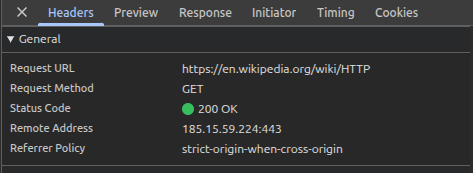
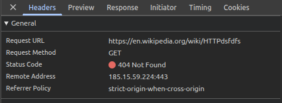
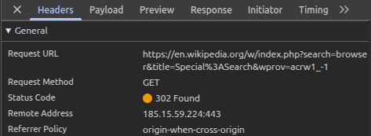
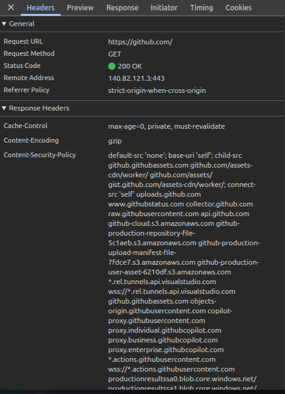

# Лабораторная работа №1
## HTTP
## Цель работы

Понять, как работает HTTP и что происходит при открытии сайта  
Научиться смотреть запросы в браузере через вкладку Network  
Разобраться с методами GET, POST, PUT, DELETE


# Задание 1

## 1. Анализ страницы Wikipedia

Сайт: https://en.wikipedia.org/wiki/HTTP

Открыл страницу, включил F12, Network, обновил страницу

### URL
https://en.wikipedia.org/wiki/HTTP

### Метод
GET

Метод GET используется потому что мы просто получаем страницу, ничего не отправляем на сервер

### Статус
200 OK

Это значит, что страница успешно грузится

### Заголовки запроса
Есть заголовки:
- Host
- User-Agent
- Accept
- Accept-Language

### Заголовки ответа
Есть:
- Content-Type
- Content-Length
- Server
- Date

### Тело запроса
Нет, потому что это GET

### Тело ответа
HTML код страницы


### Скриншот




## 2. Несуществующая страница

Открыл -
https://en.wikipedia.org/wiki/HTTPdsfdfs

Статус -
404 Not Found
Это потому что такой страницы не существует

### Скриншот 404



# Задание 2

Открыл -
https://en.wikipedia.org/wiki/Special:Search

Ввел слово - browser

Нашел запрос в Network

### URL запроса
Такооой -
https://en.wikipedia.org/w/index.php?search=browser&title=Special%3ASearch&go=Go

### Метод
GET

Используется GET, потому что поиск просто получает данные

### Параметры
search=browser - то что я ввел  
title=Special:Search - страница поиска  
go=Go - выполнение поиска  

### Скриншот поиска




# Задание 3

Я выбрал сайт https://github.com

Открыл Network и обновил страницу

### URL
https://github.com/

### Метод
GET

### Статус
200 OK

Также загружаются дополнительные файлы (css, js, картинки)


### Скриншот GitHub




# Задание 4

## GET запрос

```
GET / HTTP/1.1
Host: sandbox.usm.com
User-Agent: Svetlana Boberidze
```

User-Agent - это информация о браузере или пользователе  
Сервер может по нему понять кто делает запрос


## POST запрос

```
POST /cars HTTP/1.1
Host: sandbox.usm.com
Content-Type: application/x-www-form-urlencoded
User-Agent: Svetlana Boberidze

make=Toyota&model=Corolla&year=2020
```

POST используется для создания данных

---

## Другие методы

GET - получение  
POST - создание  
PUT - полное обновление  
PATCH - частичное обновление  
DELETE - удаление  


## PUT запрос

```
PUT /cars/1 HTTP/1.1
Host: sandbox.usm.com
User-Agent: Svetlana Boberidze
Content-Type: application/json

{
 "make": "Toyota",
 "model": "Corolla",
 "year": 2021
}
```

PUT полностью заменяет данные  
PATCH меняет только часть


## Возможный ответ сервера

```
HTTP/1.1 201 Created
Content-Type: application/json

{
 "id": 1,
 "make": "Toyota",
 "model": "Corolla",
 "year": 2020
}
```


## Возможные коды

200 - все ок  
201 - создано  
400 - ошибка в данных  
401 - нет авторизации  
403 - доступ запрещен  
404 - не найдено  
500 - ошибка сервера  


# Вывод

Я посмотрел как работают HTTP запросы, разобрался со статусами и методами  
Также научился смотреть запросы через инструменты разработчика, по идее все, если что то пропустил, простите, допишу
